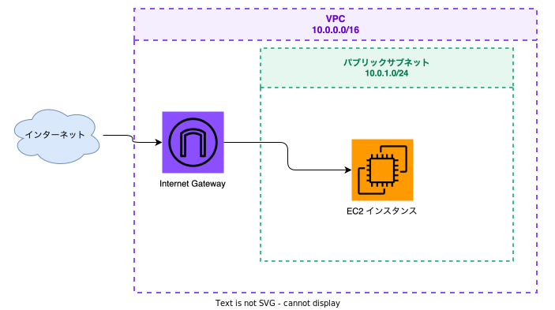

= Claude CodeでDraw.ioスキルを使う手順

== 参考
- https://github.com/jgraph/drawio-mcp#skill--cli

== 前提
- drawio-mcpを使うためには、Desktop版のdraw.ioがインストールされている必要があります。 
  - https://github.com/jgraph/drawio-desktop/releases/tag/v30.2.6

== セットアップ

[source,bash]
----
# プラグインコマンドでskillを追加する
/plugin marketplace add jgraph/drawio-mcp
/plugin install drawio@drawio

----

== 使い方

[source,bash]
----
# プロンプト例
drawioを使ってvpc内にec2インスタンスがある図をsvg形式で作成して
----

成果物

